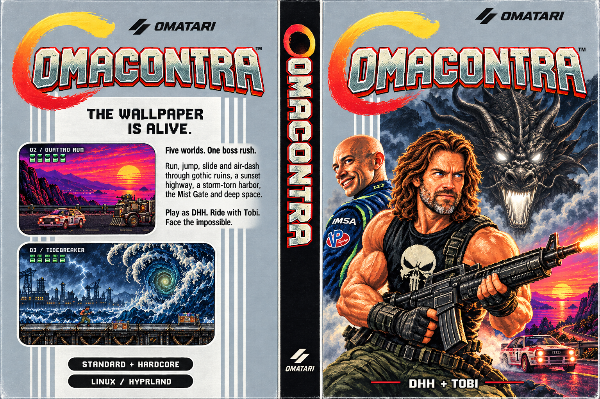

# OMACONTRA



A Contra-inspired **boss-only** fullscreen game. Five encounters bring wallpaper worlds to life: the Reaper, Quattro Run, Tidebreaker, the Mist Gate, and Black Moon. DHH runs, jumps, ducks,
and fires a machine gun. Later encounters introduce an arc rifle and a spacesuit firing stream.

**Currently keyboard and mouse only. Controller support is not yet available.**

## Install on Omarchy

Install Omacontra as a standalone app on your Omarchy desktop. The installer
creates an **Omacontra** entry in the apps menu and an executable named
`omacontra`. All artwork, music, and screensaver animations are included. The game renders
at 720p internally by default and scales to your display, keeping detailed
scene rendering independent of monitor resolution.

### Quick install

Run this in your Omarchy terminal:

```sh
curl -fsSL https://raw.githubusercontent.com/gardnmi/omacontra/main/install.sh | bash
```

No Git checkout or AUR package is needed. The installer downloads a verified runtime
release, installs missing system dependencies (asking for your password if
needed), and creates the **Omacontra** app-menu entry and `omacontra` executable.
Run it as your normal user, without `sudo`. Re-run the command to update to the
release selected by the installer; settings and personal bests are preserved.

For direct Arch package installation and offline installs, see
[direct package builds and releases](packaging/arch/README.md).

### Install from source

### 1. Install the required packages

Open a terminal in Omarchy and run:

```sh
omarchy pkg add git python python-gobject python-cairo gtk3 mpv sdl2-compat
```

Omarchy installs any missing packages and may ask for your password.

### 2. Download and install the game

Download only the latest revision and run the installer:

```sh
git clone --depth 1 --single-branch https://github.com/gardnmi/omacontra.git
cd omacontra
./install.py
```

`--depth 1` skips old Git history, including retired artwork and original music
files. Normal updates with `git pull --ff-only` still work. The source checkout
includes development assets; the packaged download is smaller.

Run the game installer as your normal user. It creates:

| Installed item | Location |
| --- | --- |
| Executable launcher | `~/.local/bin/omacontra` |
| Game and assets | `~/.local/share/omacontra/` |
| Apps-menu entry | `~/.local/share/applications/omacontra.desktop` |

### 3. Play

Open the **Omarchy apps menu**, search for **Omacontra**, and launch it.
You can also start the executable from any terminal:

```sh
omacontra
```

If your shell cannot find the command, run `~/.local/bin/omacontra` directly.
The installed game runs independently of the downloaded repository.

### Update

From your downloaded `omacontra` repository:

```sh
git pull --ff-only
./install.py
```

Updates preserve your settings and personal bests.

### Uninstall

From that same repository:

```sh
./install.py --uninstall
```

This removes the executable, game files, and apps-menu entry. Settings and records
remain in `~/.config/omacontra/profile.json` (or your `XDG_CONFIG_HOME` location).

### Troubleshooting

Run `./install.py --check` to check the required dependencies. Launch the game
inside your Omarchy desktop session. The current window host uses Hyprland's Lua
API; older Hyprland builds and other compositors are not supported yet.

## Development

To run directly from the source checkout without installing:

```sh
./omacontra
./omacontra --boss
./omacontra --level 4
```

Run the test suite and fullscreen launch check:

```sh
python tools/test.py
./omacontra --smoke-test
```

Generated review captures stay locally in `review/` and are excluded from Git.
Asset provenance and source credits remain alongside assets and in `THIRD_PARTY/`.
Optional asset-rebuild tools may additionally need ffmpeg, Pillow or ttfx; these
are not needed to play the prebuilt game. The copied window helper retains its
original MIT notice. Original game code and documentation are [MIT licensed](LICENSE);
artwork and music retain their separate terms.

## Project layout

- `src/omacontra/`: runtime package and application host.
- `src/omacontra/stages/`: Reaper, highway, harbor, dragon, and space encounters.
- `src/omacontra/rendering/`: shared sprites, poses, and visual effects.
- `src/omacontra/audio/`: soundtrack and sound-effect playback.
- `src/omacontra/ui/`: menus, story, cinematics, and continue screen.
- `tests/`: gameplay, rendering, audio, and installation regression tests.
- `tools/`: asset builders, visual reviews, and control-only playtest utilities.
- `assets/`: shipped artwork, audio, and pre-rendered screensaver frames.
- `docs/`: architecture, gameplay notes, audits, and the preserved original opening.

All runtime asset locations come from `src/omacontra/resources.py`. The installer
ships the runtime package and the assets listed in `release-assets.txt`; development tools and tests stay in the repo.
`main.py` and `./omacontra` remain supported launchers.

See [architecture](docs/ARCHITECTURE.md), [gameplay/design notes](docs/GAMEPLAY.md),
and the [full game script](GAME_SCRIPT.md).

## Version, release notes, and support

Run `omacontra --version` to identify your installed build; the menus also show it.
See [release notes](docs/RELEASE_NOTES.md), [known limitations and troubleshooting](docs/SUPPORT.md),
and [report a bug](https://github.com/gardnmi/omacontra/issues/new/choose).

## Credits and distribution terms

Original code and documentation are [MIT licensed](LICENSE).
See [sources and attribution](THIRD_PARTY/README.md) and the
[asset permissions inventory](THIRD_PARTY/ASSET_RIGHTS.md). Third-party assets
retain their own terms; the code license does not automatically cover music or artwork.
